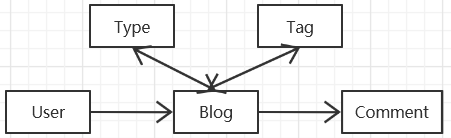
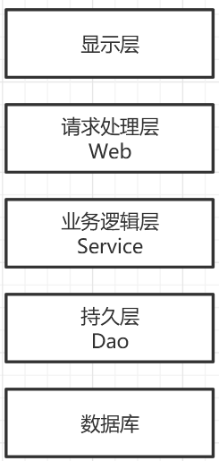
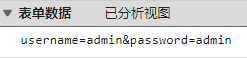
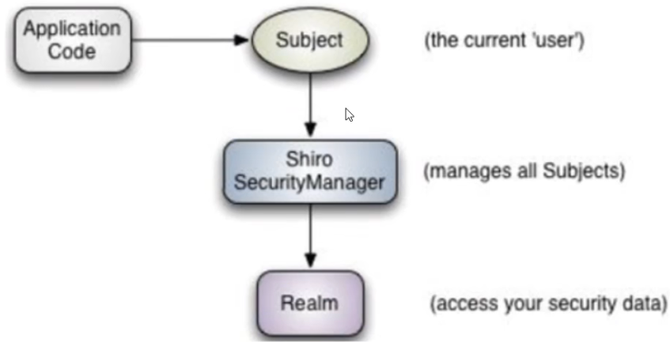

# ItsBlog
[博客演示地址](http://121.41.55.205:8080/)

## 1 实体类的设计
实体类
- 博客类 Blog
  - 标题 内容 标记 浏览次数
  - 评论开启 关注开启 版权开启
  - 发布 创建时间 更新时间
  - 分类 标签 评论 用户
  - 只能在发布界面更新其标签和分类，后面不支持更新操作
- 博客分类 Type
  - Type 分类
- 博客评论 Comment
  - 评论之间具有父子关系，博客评论之间的关系包含在Class里面
  - 昵称 邮箱 头像 评论内容 创建时间
- 用户 User
  - 昵称 用户名 密码
  - 邮箱 类型 头像
  - 创建时间 博客更新时间

实体类之间的关系



### 1.2 应用分层



### 1.3 命名方式
Service / Dao 层命名方式
- 获取单个对象  利用get做前缀
- 获取多个对象  用list做前缀
- 获取统计值阿  用count做前缀
- 插入方法     利用insert做前缀
- 删除方法     利用delete做前缀
- 修改方法     利用update做前缀

## 2 后台管理

### 2.1登录管理方式

#### 简单的管理登录方式

利用登录拦截器去实现用户的登录
当用户进入进入登录页面时候
- 输入正确用户名和密码，跳转到后台管理界面，并且加入用户的相关信息到cookies中
- 输入错误，重定向到登录界面(利用
  ```java
    redirectAttributes.addFlashAttribute("message", "用户名和密码错误");
    return "redirect:/admin";
  ```
  这种方式实现重定向并且返回错误信息.
  如果利用model的方式放回错误信息的话，重定向会导致携带的信息丢失。)
  
- 用户尝试未登录直接进入/admin下面的子页面，利用拦截器直接重定向到登录界面

##### 缺点
1. 可以看出，在传输用户名和密码的时候直接是明文传输，这种安全性很低，为了修正这种方案的缺陷，可以将，密码采用加盐，并通过md5的方式实现将密码编码成逆向存在难度的字符串。
    
    
但是这样的方式还是存在问题, 由于如果别人能截取到你的明文用户名和密码字符串的话,就一定能截取到你的密文字符串. 别人就可以直接通过重放攻击直接登录你的系统

2.  可以利用token令牌的方式来进行用户校验

3. 每次生成不同的字符串，避免重放攻击
   由于HTTP是无状态的（这一次请求并不知道上一次请求的内容），可以在MYSQL中的USER表里面生成用户的验证Challenge(UUID 或者其他的随机字符串)，当用户正确登陆后，都会更新数据库里面的Challenge值
每次前端都会将密码和验证Challenge一起生成个MD5的字符串，用这个作为前端的验证，这样每次生成的md5字符串都是不一样的，这样导致黑客尝试重放账号密码数据信息来登陆的时候导致无法成功登陆。


#### 利用Apache Shiro来完成身份验证和授权 有待完成


从这个图中可以看出构架主要分为subject，Shiro Management, Relam
subject主要是登录的用户,Shiro Management是整个系统的管理者,Relam是数据的读取
org.sincq.itsblog.config 主要完成了shiro的配置

Shiro 扩展
https://blog.csdn.net/qq_43286578/article/details/106061152
https://blog.csdn.net/qq_36551991/article/details/118112004
https://www.cnblogs.com/tony-hyn/p/11593241.html
https://github.com/likingcan/shiro-springboot

#### 利用Spring Security来完成身份验证和授权 有待完成

#### Shiro 和 Spring Security的比较


## 使用到的开源项目
感谢这些开源项目
[blueimp-md5](https://www.bootcdn.cn/blueimp-md5/)